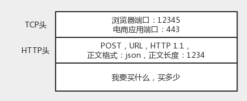
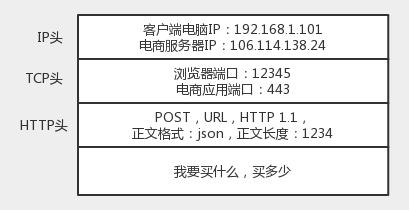
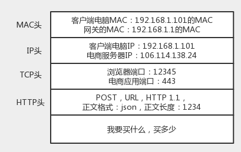
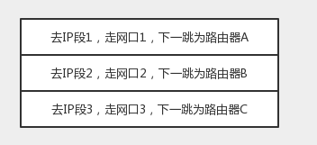
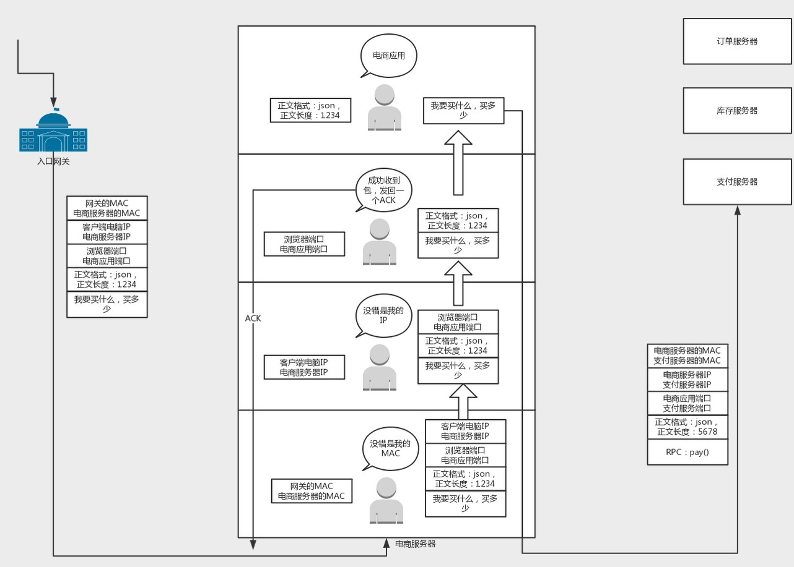
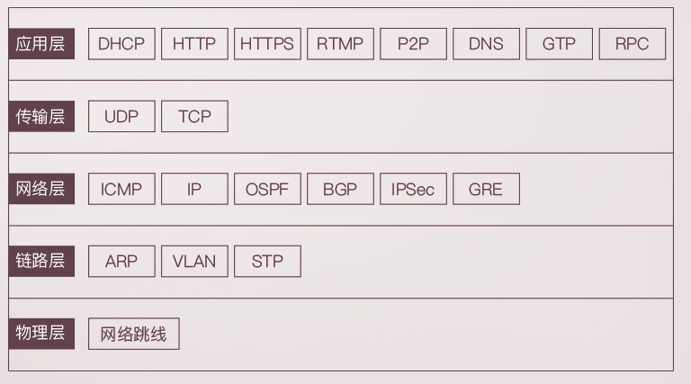

# 为什么要学习网络协议？

协议是人类和计算机沟通的桥梁，只有通过这种协议，计算机才知道我们想让它做什么。

---
## 1 协议三要素

代码可以看作一种协议，通过编译，代码转换为机器码，计算机就直到要做什么工作：


可以看得出，计算机语言作为程序员控制一台计算机工作的协议，具备了协议的三要素：

- **语法**，就是这一段内容要符合一定的规则和格式。例如，括号要成对，结束要使用分号等。
- **语义**，就是这一段内容要代表某种意义。例如数字减去数字是有意义的，数字减去文本一般来说就没有意义。
- **顺序**，就是先干啥，后干啥。例如，可以先加上某个数值，然后再减去某个数值。

要与计算机沟通，就需要懂编程(也可以理解为一种协议)，要想打造互联网世界，就需要网络协议。通过网络协议可以打造丰富多彩的网络世界，那么我们常用的网络协议有哪些？

---
## 2 常用的网络协议有哪些？

以一次电商网站的购买流程来分析，购买一件上面都使用了哪些网络协议：

### 2.1 应用层

1. 购买一件物品时，需要先进入一个电商网址，比如先在浏览器里面输入 `https://www.kaola.com` ，这是一个URL。浏览器只知道名字是 `www.kaola.com`，但是不知道具体的地点，所以不知道应该如何访问。这是就需要用到 DNS 或 HTTPDND 协议，来获取网址对应的 IP 地址。
2. 知道了目标地址，浏览器就开始打包它的请求。对于普通的浏览请求，往往会使用 HTTP 协议；但是对于购物的请求，往往需要进行加密传输，因而会使用 HTTPS 协议。

DNS、HTTP、HTTPS 所在的层我们称为应用层。经过应用层封装后，浏览器会将应用层的包交给下一层去完成，通过 socket 编程来实现。


### 2.2 传输层

传输层有两种协议，一种是无连接的协议UDP，一种是面向连接的协议TCP。HTTP 协议使用的是TCP协议，**TCP是面向连接，会保证这个包能够到达目的地。如果不能到达，就会重新发送，直至到达**。



TCP 协议里面会有两个端口，一个是浏览器监听的端口，一个是电商的服务器监听的端口。操作系统往往通过端口来判断，它得到的包应该给哪个进程。传输层封装完毕后，浏览器会将包交给操作系统的网络层。

### 2.3 网络层

网络层的协议是 IP 协议。在 IP 协议里面会有源 IP 地址，即浏览器所在机器的 IP 地址和目标 IP 地址，也即电商网站所在服务器的 IP 地址。




### 2.4 链路层

电商网站是外网网站，即与本机不在同一网段内，需要通过网关转发请求，操作系统启动的时候，就会被 DHCP 协议配置 IP 地址，以及默认的网关的 IP 地址 `192.168.1.1`，操作系统如何将 IP 地址发给网关呢？在本地通信基本靠吼(广播)，于是操作系统大吼一声，谁是 `192.168.1.1` 啊？网关会回答它，我就是，我的本地地址是 `xxxxxx`。这个本地地址就是**MAC地址**，而大吼的那一声是ARP协议。

于是操作系统将 IP 包交给了下一层，也就是 MAC 层。网卡再将包发出去。由于这个包里面是有 MAC 地址的，因而它能够到达网关。



### 2.5 路由协议

网关收到包之后，会根据自己的知识，判断下一步应该怎么走。网关往往是一个路由器，到某个 IP 地址应该怎么走，这个叫作路由表。

数据包到达电商网址的过程会经过很多的网段，同一网段内都可以使用本地的地址 MAC 进行通信。一旦要跨越网段需要IP地址。



相邻的路由器会经常沟通。到哪里应该怎么走，这种沟通的协议称为路由协议，常用的有 OSPF 和 BGP。

### 2.6 到达目的地

- 路由器与路由器之间是不同的网段，当网络包知道了下一步去哪个网段时，还是要使用目标网段路由器的 MAC 地址，通过下一个路由器的 MAC 地址，找到下一个路由器，然后再问下一步的路怎么走，一直到走出最后一个路由器。
- 最后一个路由器知道这个网络包要去的地方。于是，对着内网吼一声，谁是目标 IP 啊？目标服务器就会回复一个 MAC 地址。网络包过关后，通过这个 MAC 地址就能找到目标服务器。
- 目标服务器发现 MAC 地址对上了，取下 MAC 头来，发送给操作系统的网络层。发现 IP 也对上了，就取下 IP 头。IP 头里会写上一层封装的是 TCP 协议，然后将其交给传输层，即TCP 层。

在TCP层，对于收到的每个包，都会有一个回复的包说明收到了。这个回复的包绝非这次下单请求的结果，而是TCP协议中收到数据的确认包，因为发送端收到接收端确认包后才会认为数据包已经发送成功，否则如果发送端发送数据后过一段时间没收到确认包，发送端的 TCP 层会重新发送这个包，除非 TCP 这一层出了问题，例如连接断了，才会轮到浏览器的应用层重新发送下单请求。

当网络包平安到达 TCP 层之后，TCP 头中有目标端口号，通过这个端口号，可以找到电商网站的进程正在监听这个端口号，假设一个 Tomcat，将这个包发给电商网站，处理过程如下图：



电商网站的进程得到 HTTP 请求的内容，知道了要买东西，买多少。会进行进一步的处理。


---
## 3 有了 IP，为什么还需要 MAC 地址

当网络包到达一个网段的时候，可以通过路由表得到下一个网段路由器的 IP 地址，直接通过 IP 地址找就可以了，为什么还要通过本地的 MAC 地址呢？

- ip是网络层使用的，mac是链路层使用的，ip包最终还是要通过物理链接和mac地址进行交互
- 局域网内IP地址是动态分配的，假如我是192.168.2.100，如果我下线了，可能IP就分配给了另一台电脑。IP和设备并不总是对应的，这对通信就产生了问题，但是MAC地址不同，MAC地址和设备是 一 一 对应且全球唯一的。所以局域网使用MAC地址通信没有问题。
- 历史遗留问题：早期的以太网只有交换机，没有路由器，以太网内通过MAC地址通信。后来才有了互联网，为了兼容原本的模式，采用了IP+MAC地址通信的方式。为啥不推到了重来呢？看看IPv6的处境你就知道了。所以是先有MAC地址后有的IP，IP的提出主要还是因为MAC地址本身的缺陷，这个问题换成有了MAC为何还要IP地址也很有意思。
- MAC地址本身的缺陷：因为MAC地址是硬件提供商写在网卡中的，MAC地址虽然唯一但是不能表明用户在整个互联网中的位置，除非维护一个超级大MAC地址对应表，那寻址效率肯定爆炸。但是IP地址解决了这个问题，因为IP地址是网络提供商给你的，所以你在哪里整个网络都是知道的。
- 安全问题：获取MAC地址是通过ARP协议来完成的，如果只用MAC地址通信，那么广播风暴是个难题。

关于 IP 地址和 Mac 地址：

- 假如有MAC地址没有ip地址可以吗？答案是不行，因为全世界存在各种网络，它们使用不同硬件地址。要使这些网络能互相通信就必须进行非常复杂的硬件地址转换工作。但可以用抽象的ip地址把这个问题解决。
- 假如没有MAC地址而只有ip呢？同样不行，ip地址只是一种抽象的逻辑地址用于标记唯一性，而传输的数据是要从网络层到数据链路层或由数据链路层到网络层的，ip数据报并不能和下层硬件“沟通”，所以还要被封装MAC帧。即将IP地址解析为链路层所需硬件地址。

---
## 4 总结

一个简简单单的下单过程，中间牵扯到这么多的协议。而管理一大片机器，更是一件特别有技术含量的事情。除此之外，像最近比较火的云计算、容器、微服务等技术，也都需要借助各种协议，来达成大规模机器之间的合作。

网络五层模型：



---
## 5 知识补充

### ARP 协议

地址解析协议，即ARP（Address Resolution Protocol），是根据IP地址获取物理地址的一个TCP/IP协议。主机发送信息时将包含目标IP地址的ARP请求广播到网络上的所有主机，并接收返回消息，以此确定目标的物理地址；收到返回消息后将该IP地址和物理地址存入本机ARP缓存中并保留一定时间，下次请求时直接查询ARP缓存以节约资源。——百度百科

```
C:\Users\Administrator
λ arp

显示和修改地址解析协议(ARP)使用的“IP 到物理”地址转换表。

ARP -s inet_addr eth_addr [if_addr]
ARP -d inet_addr [if_addr]
ARP -a [inet_addr] [-N if_addr] [-v]

  -a            通过询问当前协议数据，显示当前 ARP 项。
                如果指定 inet_addr，则只显示指定计算机
                的 IP 地址和物理地址。如果不止一个网络
                接口使用 ARP，则显示每个 ARP 表的项。
  -g            与 -a 相同。
  -v            在详细模式下显示当前 ARP 项。所有无效项
                和环回接口上的项都将显示。
  inet_addr     指定 Internet 地址。
  -N if_addr    显示 if_addr 指定的网络接口的 ARP 项。
  -d            删除 inet_addr 指定的主机。inet_addr 可
                以是通配符 *，以删除所有主机。
  -s            添加主机并且将 Internet 地址 inet_addr
                与物理地址 eth_addr 相关联。物理地址是用
                连字符分隔的 6 个十六进制字节。该项是永久的。
  eth_addr      指定物理地址。
  if_addr       如果存在，此项指定地址转换表应修改的接口
                的 Internet 地址。如果不存在，则使用第一
                个适用的接口。
示例:
  > arp -s 157.55.85.212   00-aa-00-62-c6-09.... 添加静态项。
  > arp -a                                  .... 显示 ARP 表。
```

### 网关

网关(Gateway)又称**网间连接器**、**协议转换器**。网关在网络层以上实现网络互连，是最复杂的网络互连设备，仅用于两个高层协议不同的网络互连。网关既可以用于广域网互连，也可以用于局域网互连。 网关是一种充当转换重任的计算机系统或设备。使用在不同的通信协议、数据格式或语言，甚至体系结构完全不同的两种系统之间，网关是一个翻译器。与网桥只是简单地传达信息不同，网关对收到的信息要重新打包，以适应目的系统的需求。同层--应用层。

说明：由于历史的原因，许多有关TCP/IP的文献曾经把网络层使用的路由器称为网关，在今天很多局域网采用都是路由来接入网络，因此通常指的网关就是路由器的IP。——维基百科
